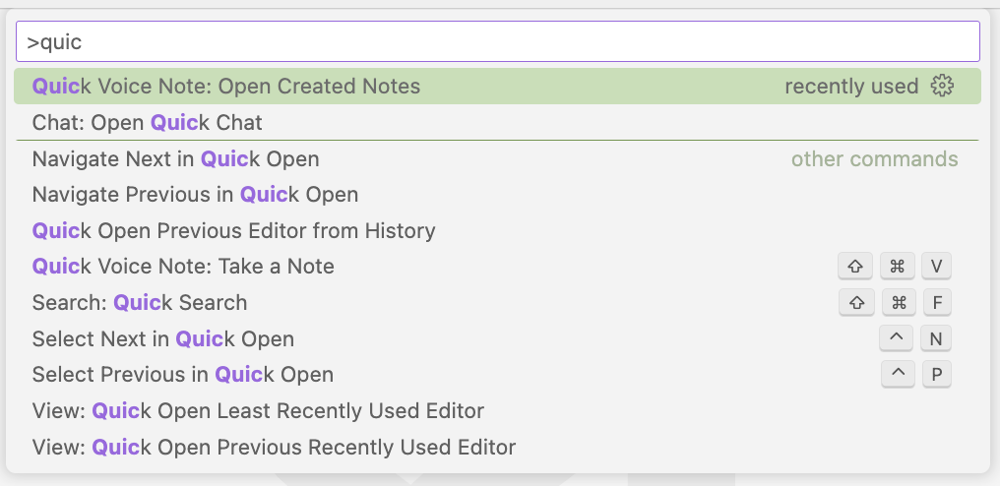

# Quick Voice Note

> Start taking voice notes with one shortcut (`cmd (ctrl) + shift + v`) ! 

## Show case

## Extra features

Use `Open Created Notes` to view your previous notes. Also, you can change the notes' storage directory by changing `quick-voice-note.noteFolder` in your `settings.json`.

**Enjoy!**
